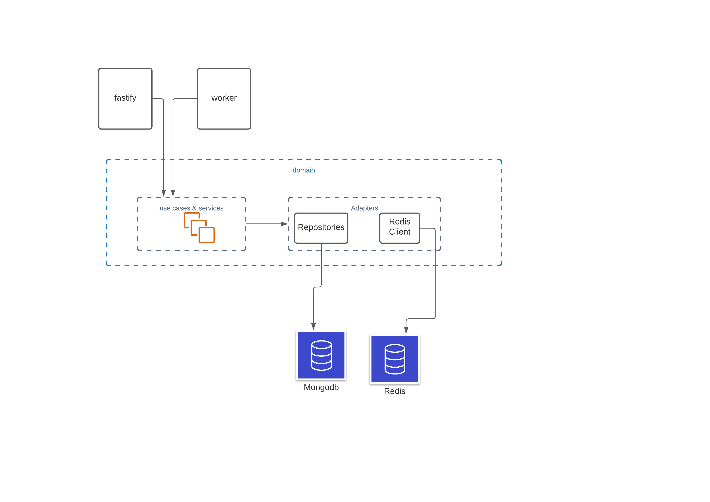

### What I built

The architecture of the app is is a variation of clean code/hexagonal architecture.

---

#### API Documentation
link to api [doc](https://documenter.getpostman.com/view/263074/Tz5s5cty)
---

### Running the app

- Create a `.env` in the base directory, docker compose and the app depends on a `.env` existing.
- The following with suitable values needs to be put inside the created `.env` file:

`MONGODB_URL==mongodb://mongodb:27017`

`REDIS_URL==redis://redis:6379`

`PROCESS_TYPE=web`

`PORT=5000`

run `docker-compose build & docker-compose up`

---

### Future Improvements

- More test coverage.

---

### Thanks for the Fun!